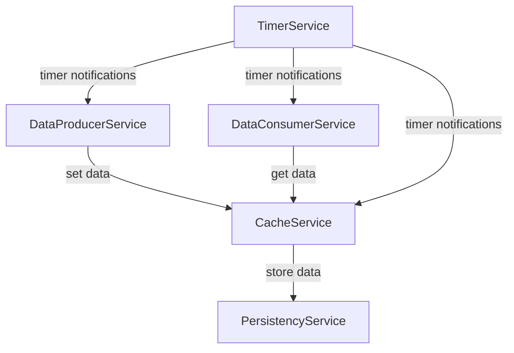

# Client Server Pub/Sub Example Architecture

This diagram shows the communication paths between different services in the example application.

## Service Descriptions

- **TimerService**: Controls timing and sends notifications to other services
- **CacheService**: Handles data caching with inputs from producer and consumer and store data in persistency
- **PersistencyService**: Manages data persistence
- **DataProducerService**: Produces data into the system
- **DataConsumerService**: Consumes data from the system
